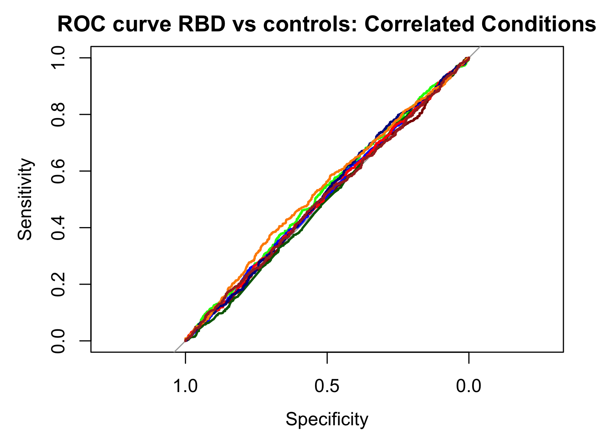

# PRS_comparisons
Using AUC analysis to see how well the polygenic risk profiles of RBD and of various conditions can differentiate between RBD cases and controls.  

Polygenic risk profiles were defined as GWAS significant (and replicated) variants, except for DLB, were the p-value threshold was determined by permutation by Scholz et. al., and RBD, where the FDR threshold was applied. Risk scores were calulcated in an idiopathic RBD cohort (cases=1037, controls=909) using plink.  

Genetic profiles to test were determined based on previous associations to PD and/or genetic correlation with RBD. 

## Testing RBD PRS performance in RBD
```R
require(data.table)
require(pROC)

RBD_FDR <- fread("rbd_meta_fdr_adjusted.profile", header = T)
RBD_FDR <- subset(RBD_FDR, PHENO != -9)
RBD_FDR$PHENOT <-ifelse(RBD_FDR$PHENO==1, "CONTROL", ifelse(RBD_FDR$PHENO==2,"RBD", NA))

rocAuc <- roc(RBD_FDR$PHENO, RBD_FDR$SCORE)
auc(rocAuc) # 0.662
ci(rocAuc, of="auc") # 0.637-0.685 (DeLong)
coords(rocAuc, "best") # threshold: 0.00266 # specificity: 0.60 # sensitivity: 0.66
thresh <- coords(rocAuc, "best")[1]

png("TEST_AUC_RBD-FDR_cont.png", width = 5.5, height = 4, units = "in", res = 300)

rocobj <- plot.roc(RBD_FDR$PHENO, RBD_FDR$SCORE,  main="ROC curve RBD vs controls",
                   percent=FALSE,  ci=TRUE, print.auc=TRUE, col = "darkred")
ciobj <- ci.se(rocobj, specificities=seq(0, 1, 0.05))
plot(ciobj, type="shape", col="gray90")

dev.off()
```


### Quartile analysis
```R
RBD_FDR$quartile <- with(RBD_FDR, cut(SCORE, 
                                breaks=quantile(SCORE, probs=seq(0,1, by=0.25), na.rm=TRUE), 
                                include.lowest=TRUE, labels = 1:4))

RBD_FDR$PHENO_BI = RBD_FDR$PHENO-1

fit_quar <- glm(RBD_FDR$PHENO_BI ~ as.factor(RBD_FDR$quartile), family = "binomial")
summary(fit_quar) # this is ok for now, but need to add covariates and put results into a table. 

png("RBD-FDR_PRS_Quartiles.png", width = 5.5, height = 4, units = "in", res = 300)

q = ggplot(RBD_FDR, aes(x=RBD_FDR$quartile, y=RBD_FDR$SCORE)) 
q2 = q + geom_boxplot(aes(fill = as.factor(RBD_FDR$PHENO)), position = position_dodge(0.9)) +
  scale_fill_manual(values = c("#00AFBB", "#E7B800"), name = "Phenotype", labels = c("Control", "Case"))
q3 = q2 + ggtitle("RBD PRS: Quartiles") + xlab("Quartile") + ylab("Score") + theme(plot.title = element_text(hjust = 0.5))
q3

dev.off()
````


## Comparing PD +/- RBD
**Testing both the RBD and PD PRS.**  
PD PRS is calculated using the GWAS significant variants from the latest PD GWAS (Nalls et. al. 2019)  

**PD PRS:**
```R
PDwRBD_PD = fread("PDwRBD_meta5.profile", header = T)
PDnoRBD = fread("PDnoRBD_meta5.profile", header = T)

PDwRBD_PD = subset(PDwRBD_PD, PHENO != -9)
PDnoRBD_PD = subset(PDnoRBD_PD, PHENO != -9)

count = subset(PDwRBD_PD, PHENO == 2)
nrow(count) # 285
count = subset(PDnoRBD_PD, PHENO == 2)
nrow(count) # 217
count = subset(PDwRBD_PD, PHENO == 1)
nrow(count) # 902 controls 

rocAuc <- roc(PDwRBD_PD$PHENO, PDwRBD_PD$SCORE)
auc(rocAuc) # 0.6648
ci(rocAuc, of="auc") # 95% CI: 0.6295-0.7001 (DeLong)
coords(rocAuc, "best") # threshold: -0.01 # specificity 0.59 # sensitivity 0.67

rocAuc <- roc(PDnoRBD_PD$PHENO, PDnoRBD_PD$SCORE)
auc(rocAuc) # 0.6679
ci(rocAuc, of="auc") # 95% CI: 0.628-0.7078 (DeLong)
coords(rocAuc, "best") # threshold: -0.01 # specificity: 0.49 # sensitivity: 0.78

png("PDandRBD_meta5_PRS.png", width = 5.5, height = 4, units = "in", res = 300)

rocobj <- plot.roc(PDwRBD$PHENO, PDwRBD$SCORE,  main="ROC curve PD +/- RBD vs Controls: PD risk profile",
                   percent=FALSE,  ci=TRUE, print.auc=TRUE, col = "darkred")

rocobj <- plot.roc(PDnoRBD$PHENO, PDnoRBD$SCORE,
                   percent=FALSE,  ci=TRUE, print.auc=TRUE, col = "darkblue", print.auc.y = .4, add = TRUE)

dev.off()
```


**RBD PRS**
```R
PDwRBD_RBD = fread("PDwRBD_rbd-fdr.profile", header = T)
PDnoRBD_RBD = fread("PDnoRBD_rbd-fdr.profile", header = T)

PDwRBD_RBD = subset(PDwRBD_RBD, PHENO != -9)
PDnoRBD_RBD = subset(PDnoRBD_RBD, PHENO != -9)

# PD+RBD
rocAuc <- roc(PDwRBD_RBD$PHENO, PDwRBD_RBD$SCORE)
auc(rocAuc) # 0.5969
ci(rocAuc, of="auc") # 95% CI: 0.5597-0.6341 (DeLong)
coords(rocAuc, "best") # threshold: 0.0008 # specificity 0.55 # sensitivity: 0.60

# PD-RBD
rocAuc <- roc(PDnoRBD_RBD$PHENO, PDnoRBD_RBD$SCORE)
auc(rocAuc) # 0.5475
ci(rocAuc, of="auc") # 95% CI: 0.5048-0.5903 (DeLong)
coords(rocAuc, "best") # threshold: 0.0004375 # specificity: 0.53 # sensitivity: 0.54

png("PDandRBD_RBD-FDR_PRS.png", width = 5.5, height = 4, units = "in", res = 300)

rocobj <- plot.roc(PDwRBD_RBD$PHENO, PDwRBD_RBD$SCORE,  main="ROC curve: PD +/- RBD vs controls: RBD Profile",
                   percent=FALSE,  ci=TRUE, print.auc=TRUE, col = "darkred")

rocobj <- plot.roc(PDnoRBD_RBD$PHENO, PDnoRBD_RBD$SCORE,
                   percent=FALSE,  ci=TRUE, print.auc=TRUE, col = "darkblue", print.auc.y = .4, add = TRUE)

dev.off()
```


## Testing genetically correlated conditions 
```R

SCZ <- fread("scz_test.profile", header = T) 
BIP <- fread("bipolar_test.profile", header = T)
INS <- fread("insomnia_test.profile", header = T)
NARC <- fread("narc_test.profile", header = T)
MS <- fread("MS_test.profile", header = T)
AD <- fread("AD_test.profile", header = T)
PD <- fread("PD_test.profile", header = T)
DIAB2 <- fread("diab2_test.profile", header = T)

DLB <- fread("dlb_sonja_hg19.profile", header = T)
DLB <- subset(DLB, PHENO != -9)
DLB_noAPOE <- fread("dlb_sonja_hg19_noAPOE.profile", header = T)
DLB_noAPOE <- subset(DLB_noAPOE, PHENO != -9)
````

## Create ROC curve
```R
png("TEST_AUC_RBD_cont.png", width = 5.5, height = 4, units = "in", res = 300)

rocobj <- plot.roc(SCZ$PHENOT, SCZ$SCORE,  main="ROC curve RBD vs controls: Correlated Conditions",
                   percent=FALSE,  ci=TRUE, print.auc=F, col = "darkred")
rocobj <- plot(roc(INS$PHENOT, INS$SCORE), print.auc = F, 
     col = "green", add = TRUE)
rocobj <- plot(roc(BIP$PHENOT, BIP$SCORE), print.auc = F, 
               col = "blue", add = TRUE)
rocobj <- plot(roc(DIAB2$PHENOT, DIAB2$SCORE), print.auc = F, 
                col = "darkorange", add = TRUE)
rocobj <- plot(roc(NARC$PHENOT, NARC$SCORE), print.auc = F, 
               col = "darkgreen", add = TRUE)
rocobj <- plot.roc(RBD$PHENOT, RBD$SCORE,  main="ROC curve RBD vs controls",
                   percent=FALSE,  ci=TRUE, print.auc=TRUE, col = "darkblue", add = TRUE)

rocobj <- plot.roc(AD$PHENOT, AD$SCORE,  main="ROC curve RBD vs controls",
                    percent=FALSE,  ci=TRUE, print.auc=F, col = "red", add = TRUE)
rocobj <- plot(roc(PD$PHENOT, PD$SCORE), print.auc = F, 
               col = "darkblue", add = TRUE)
rocobj <- plot(roc(MS$PHENOT, MS$SCORE), print.auc = F, 
                       col = "darkorange", add = TRUE)
rocobj <- plot(roc(DIAB2$PHENOT, DIAB2$SCORE), print.auc = F, 
               col = "brown", add = TRUE)

dev.off()
```

